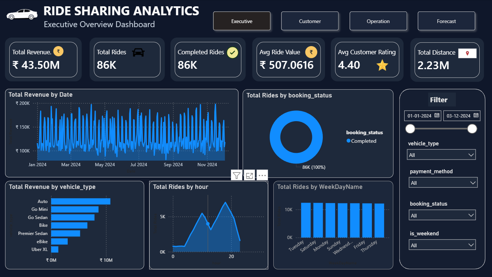

## 🚖 Ride Sharing Analytics Dashboard

### 📌 Project Overview

This project is an end-to-end Business Intelligence solution built for analyzing ride-sharing data using:

* Python
* MySQL
* Power BI

The dashboard provides insights into:

* Revenue trends
* Ride demand patterns
* Vehicle performance
* Customer experience
* Operational efficiency

The project demonstrates the complete analytics workflow from data cleaning to interactive dashboard creation.

---

## 🧠 Problem Statement

Ride-sharing companies generate large amounts of operational data daily.
The objective of this project is to transform raw ride booking data into meaningful business insights using modern data analytics and BI techniques.

The dashboard helps answer business questions such as:

* How is revenue performing over time?
* Which vehicle types generate maximum revenue?
* What are the peak ride demand hours?
* What is the ride completion and cancellation rate?
* How do customer ratings vary?

---

## ⚙️ Tech Stack

| Tool     | Purpose                             |
| -------- | ----------------------------------- |
| Python   | Data Cleaning & Feature Engineering |
| Pandas   | Data Processing                     |
| MySQL    | Database Storage                    |
| Power BI | Dashboard & Visualization           |
| DAX      | KPI & Business Calculations         |

---

## 🔄 Project Workflow

```text
Raw Dataset
    ↓
Python Data Cleaning
    ↓
Feature Engineering
    ↓
MySQL Database
    ↓
Power BI Connection
    ↓
Star Schema Data Modeling
    ↓
DAX Measures & KPIs
    ↓
Interactive Dashboard
```

---

## 📸 Dashboard Preview



---

## 📊 Dashboard Features

### KPIs

* Total Revenue
* Total Rides
* Completion Rate
* Average Ride Value
* Average Customer Rating
* Total Distance

### Visualizations

* Revenue Trend Analysis
* Ride Status Distribution
* Revenue by Vehicle Type
* Ride Demand by Hour
* Ride Demand by Day of Week

### Interactive Features

* Dynamic Filters
* Slicers
* Navigation Buttons
* Responsive KPI Cards

---

## 📂 Dataset Features

The cleaned dataset contains the following columns:

* Date
* Time
* Booking ID
* Booking Status
* Customer ID
* Vehicle Type
* Pickup Location
* Drop Location
* Avg VTAT
* Avg CTAT
* Booking Value
* Ride Distance
* Driver Ratings
* Customer Ratings
* Payment Method
* Datetime
* Hour
* Day
* Weekday
* Month
* is_weekend

---

## 🏗️ Data Modeling

The dashboard follows a **Star Schema** model.

### Fact Table

* Fact_Rides

### Dimension Tables

* Dim_Date
* Dim_Vehicle
* Dim_Payment
* Dim_Status
* Dim_PickupLocation
* Dim_DropLocation

---


## 📈 Key Insights

* Peak ride demand occurs during evening hours.
* SUVs contribute the highest revenue.
* Weekend ride demand is significantly higher.
* Ride completion rate remains above 90%.
* UPI is the most preferred payment method.

---

## 🎨 Dashboard UI

The dashboard uses a modern dark-themed UI with:

* Rounded KPI cards
* Interactive visuals
* Consistent color palette
* Executive-level layout
* Business-focused storytelling

---


## 🚀 Future Improvements

* Customer & Location Intelligence Dashboard
* Operational Performance Analytics
* Forecasting & Prediction Module
* Machine Learning Demand Prediction
* Real-time Dashboard Integration

---

## 📚 Skills Demonstrated

* Data Cleaning
* Feature Engineering
* SQL Integration
* Data Modeling
* DAX Calculations
* KPI Engineering
* Data Visualization
* Dashboard UI/UX
* Business Intelligence

---
## 👨‍💻 Author

Amit kumar

[](https://www.linkedin.com/in/amit-kumar-c/)

---
